# 專案名稱 KeithCoffee

## 簡介
網站主軸是一個咖啡店的店商網站，主要使用Django，並利用Bootstrap 5套件來打造現代化的前端。為了增添視覺和內容豐富度，我使用了ChatGPT和Midjourney兩項AI工具，ChatGPT用於生成相關內容，Midjourney用於創建引人注目的圖片。此外還有添加一頁Google Map資訊的店家搜尋功能，以提供更多實用性。

## 使用環境
* Anaconda Spyder
    > Django 後端開發。
* Sublime Text 3
    > 前端html、css開發。

## 網站頁面
1. 主頁
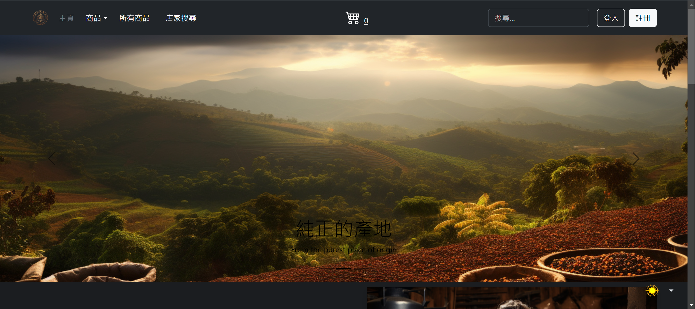
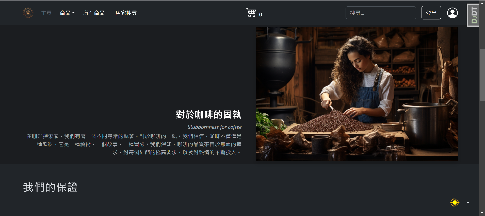
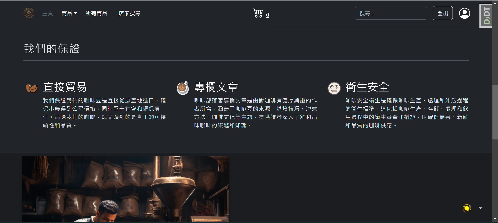
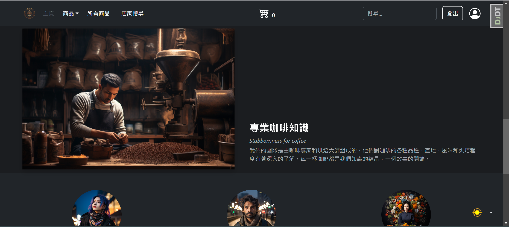
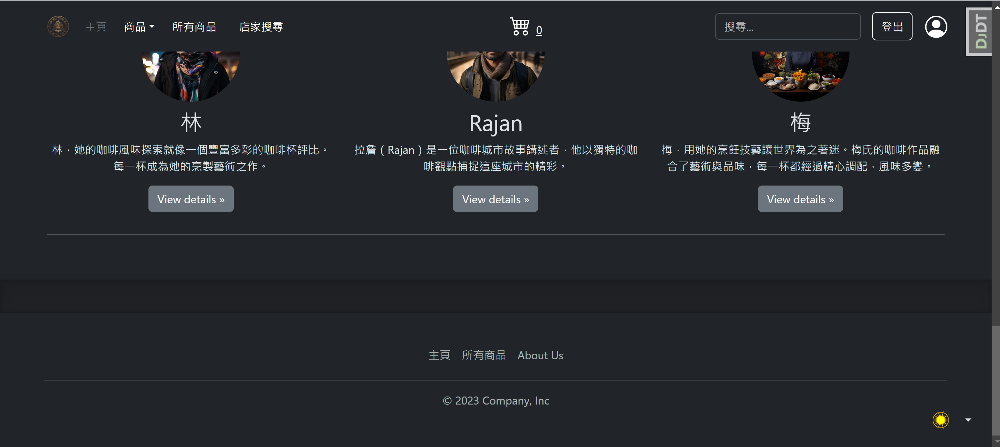

2. 商品頁面
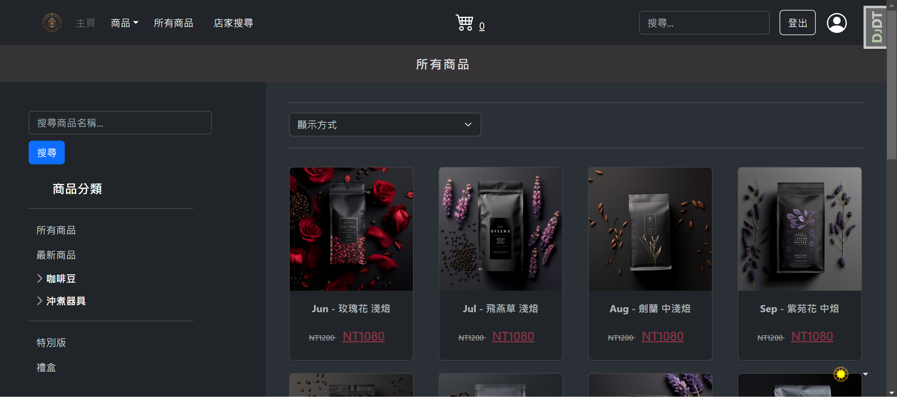
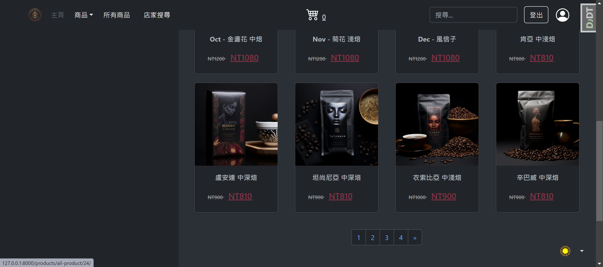

3. 產品頁面
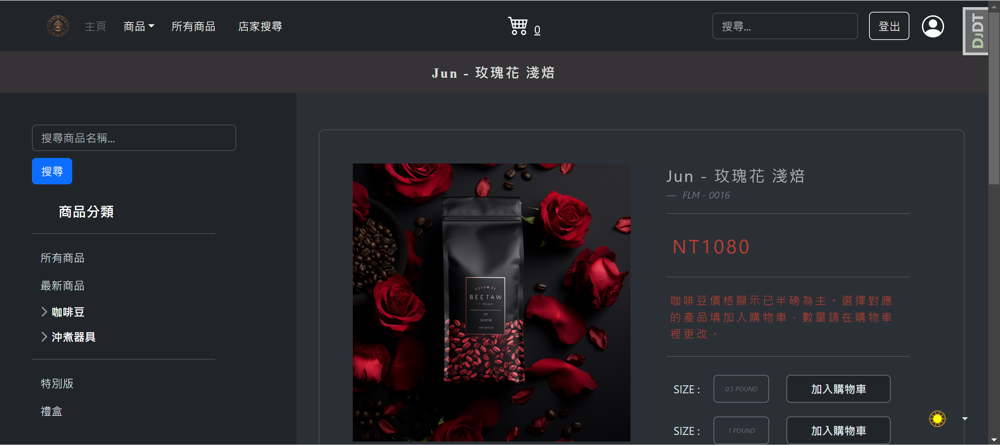
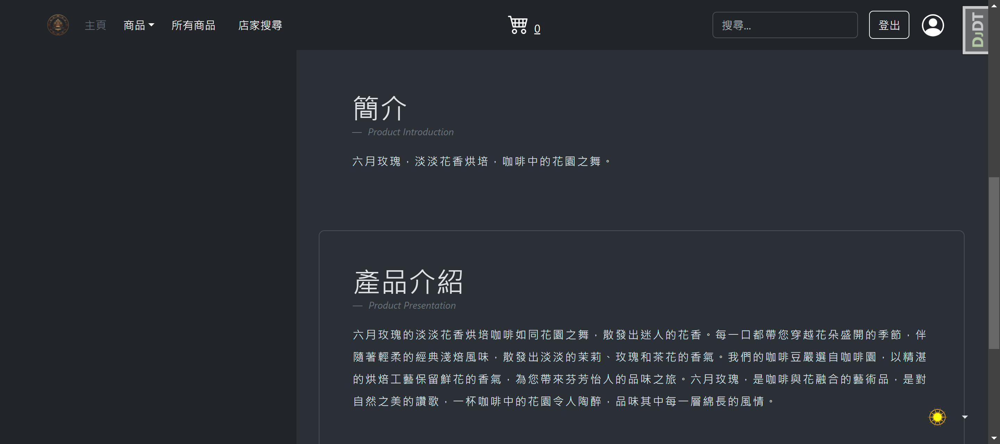

4. 購物車頁面
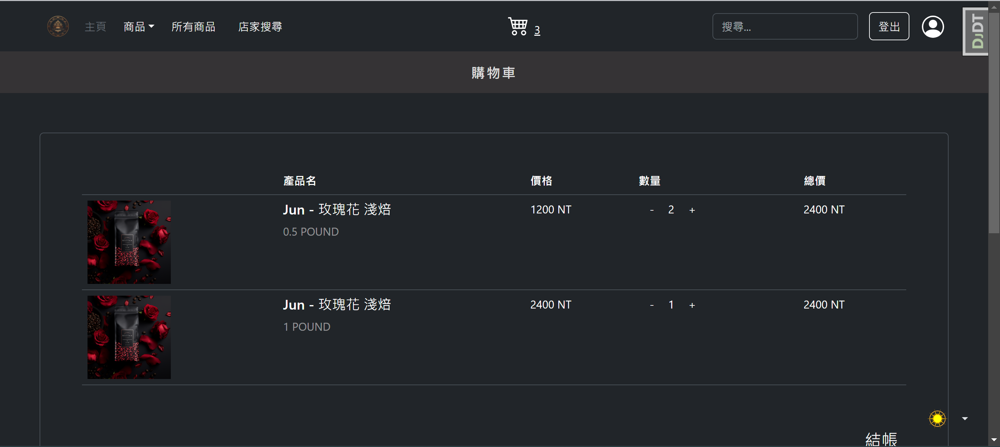
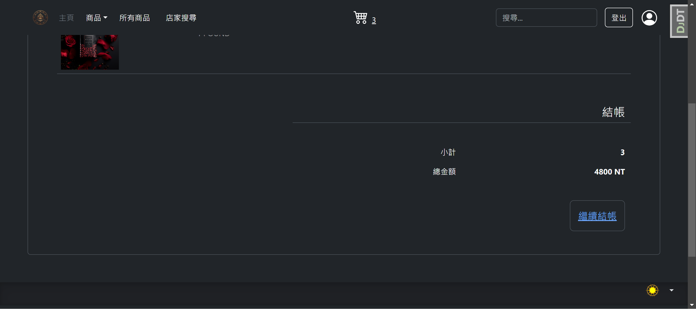

5. 會員頁面
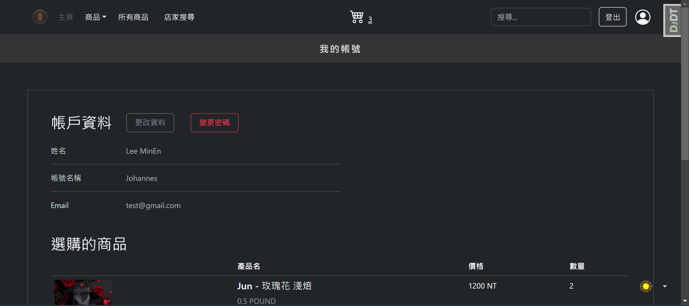
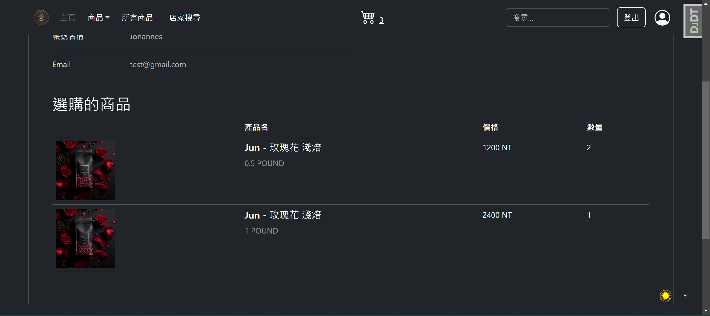

6. 結帳頁面
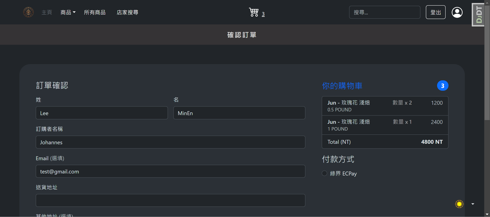
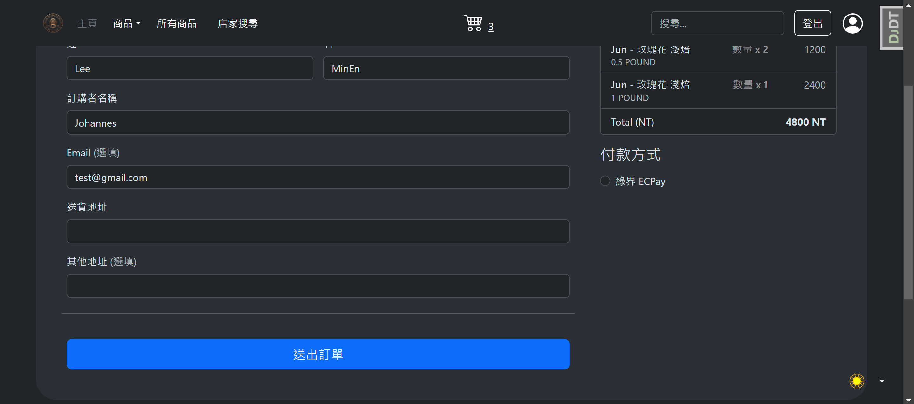

7. 店家搜尋頁面
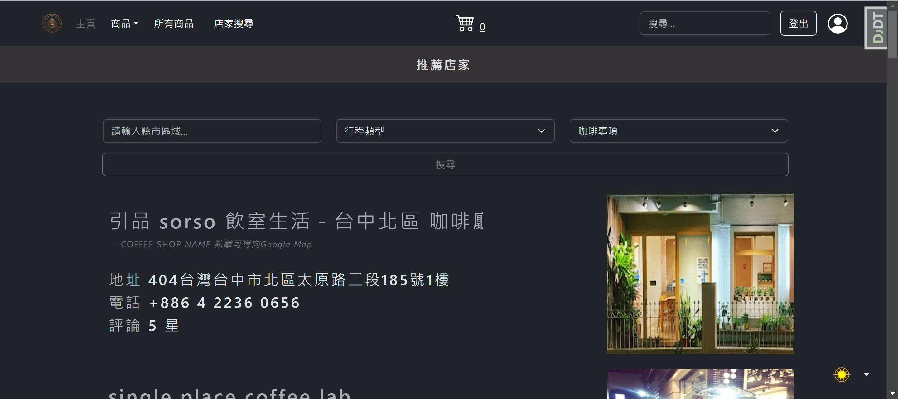
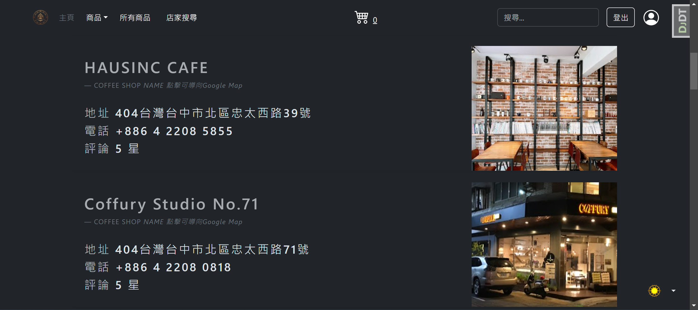

8. 帳號頁面
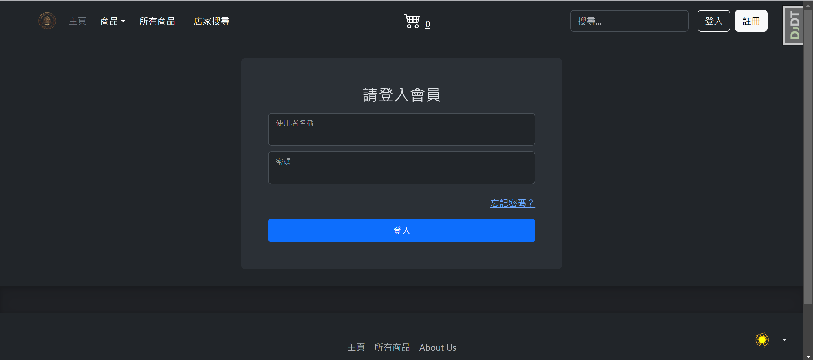
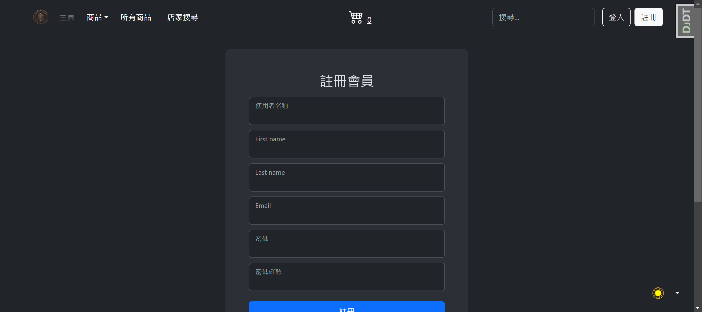
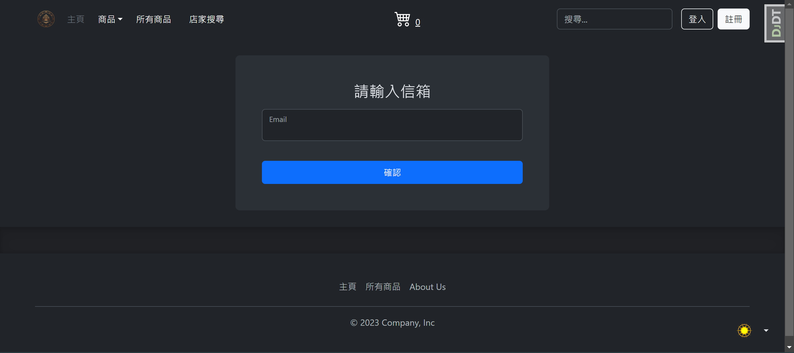
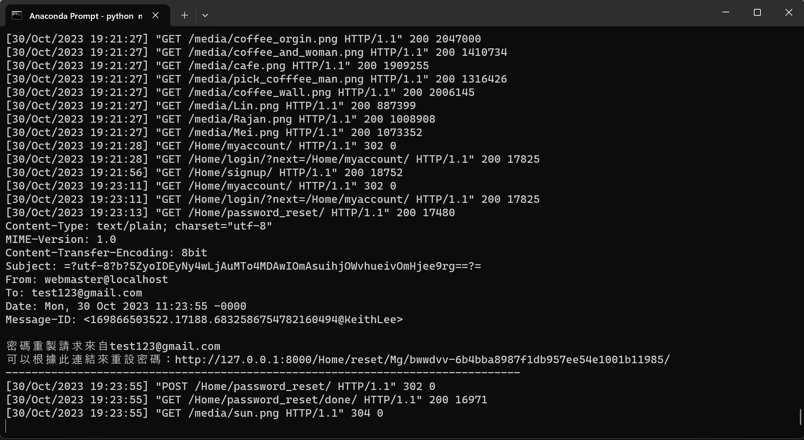
### 

