# 專案名稱 KeithCoffee

## 簡介
網站主軸是一個咖啡店的店商網站，主要使用Django，並利用Bootstrap 5套件來打造現代化的前端。為了增添視覺和內容豐富度，我使用了ChatGPT和Midjourney兩項AI工具，ChatGPT用於生成相關內容，Midjourney用於創建引人注目的圖片。此外還有添加一頁Google Map資訊的店家搜尋功能，以提供更多實用性。

## 開發堆疊
### 環境
    * Anaconda Spyder
        > Django 後端開發。
    * Sublime Text 3
        > 前端html、css開發。
### 資料庫
    * MySQL
### API
    * Goole Maps Platform
        > Places API
        > Gecoding API
### debug tool
    * Django Debug Toolbar

## 安裝與部屬
**以下指令都於終端機完成**

1. 下載虛擬環境
    > pip install virtualenvwrapper-win
2. 創建虛擬環境
    > 使用mkvirtualenv命令來創建一個名為keithcoffee的新虛擬環境。
    > mkvirtualenv keithcoffee 
3. 使用建構的虛擬環境
    > workon keithcoffee
4. 下載django
    > pip install django
5. 下載其他套件
    > * pip install mysqlclient (連接mysql)
    > * pip install Pillow (專案連接圖片路徑專用)
    > * pip install django-debug-toolbar (除錯工具)
    > * pip install googlemaps (google api)
6. 下載mysql 
    > * 官網連結: https://dev.mysql.com/downloads/mysql/
    > * 下載設定密碼可先設 1234567890 (本django專案設定的密碼)
7. 創建mysql database
    > * 進到終端機輸入mysql -u root -p 輸入後進到mysql
    > * 進入後輸入 create database keithcoffee(django資料庫名稱) default set utf8 collate urf8_general_ci; 創建資料庫
8. 啟動專案
    > * 從終端機進到下載的專案有manage.py的根目錄
    > * 輸入 pyhton manage.py runserver 如果沒有其他error就啟動成功了！
9. 進到網站瀏覽器網址框輸入 http://127.0.0.1:8000/ 進到頁面。

## 後端介紹
接下來會以產品為出發點去做其他功能的延伸。
### product models.py
* Product (產品)
    除了基本的名稱、價格、描述、圖片、上架狀態以外，還有商品種類與編號， 
    編號構想是想透過編號上面種類的名稱，更能準確的讓員工或者消費者快速的找到產品。
    在設計編號時，想要透過選取的商品種類可以自動生成帶有商品種類的編號，所以預設填寫設定可以是空值。
    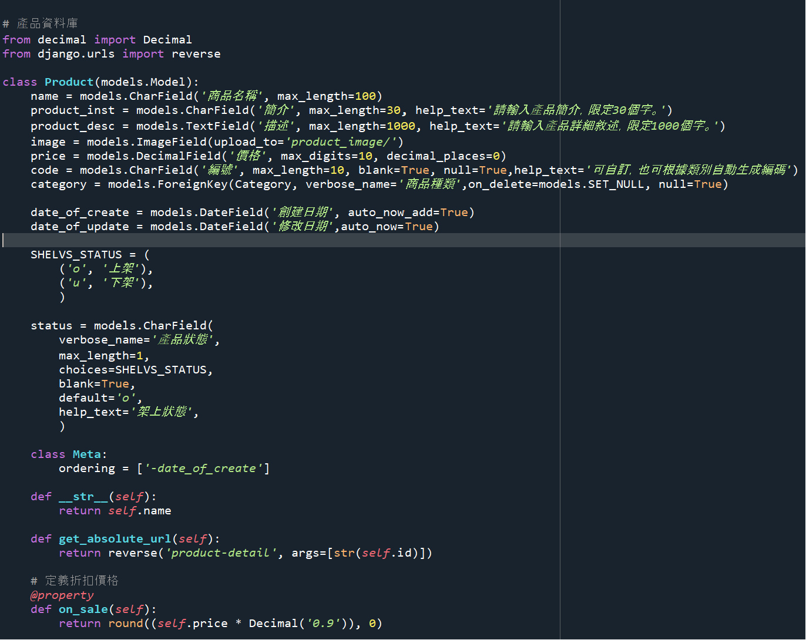       
    使用了post_save信號，當一個Product模型的實例保存到資料庫時，這個信號觸發了generate_product_code函數。
    並且會在新增時判斷實例中有無code的存在，如果沒有的話就夠建一個自定義的code資料進實例裡面。
    流程: 
    1. 使用receiver註冊信號post_save與Product model
    2. 保存Product實例時觸發post_save信號。 
    3. 觸發generate_product_code函數，這個函數會接收相關訊息。包括sender(發送信號的模型)、instance(此模型的實立)、created(判斷是否構建)。
    4. 執行函式內部邏輯生成並保存code。
    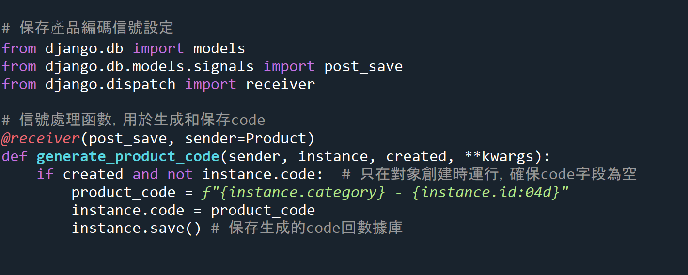 

* ProductVariant (產品變體)
    因為網站是以咖啡豆為出發點去設計，所以想到咖啡有可能會有一樣品項但是咖啡克數不一樣的情況，所以另外建構一個ProductVariant模型當作Product的外鍵變體。
    但是當初設計此模型時沒有考慮到價格會因為咖啡克數而不一樣的問題，所以在之後呈現變體價格時，透過調用Product模型的價格資料去做相對應的呈現。
    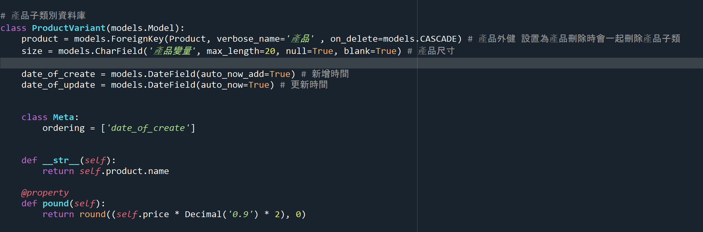 

* Category (產品類型)
    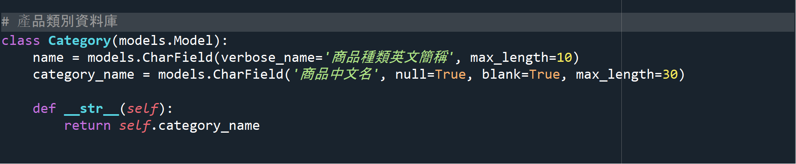
    設計讓產品分類呈現給使用者。除了更好搜尋之外，也讓網站更多元性。

### product admin.py
後台admin管理頁面增添了一個ProdictVariant模型的選項進ProductAdmin裡面，增加再填寫產品資料時的便利性。
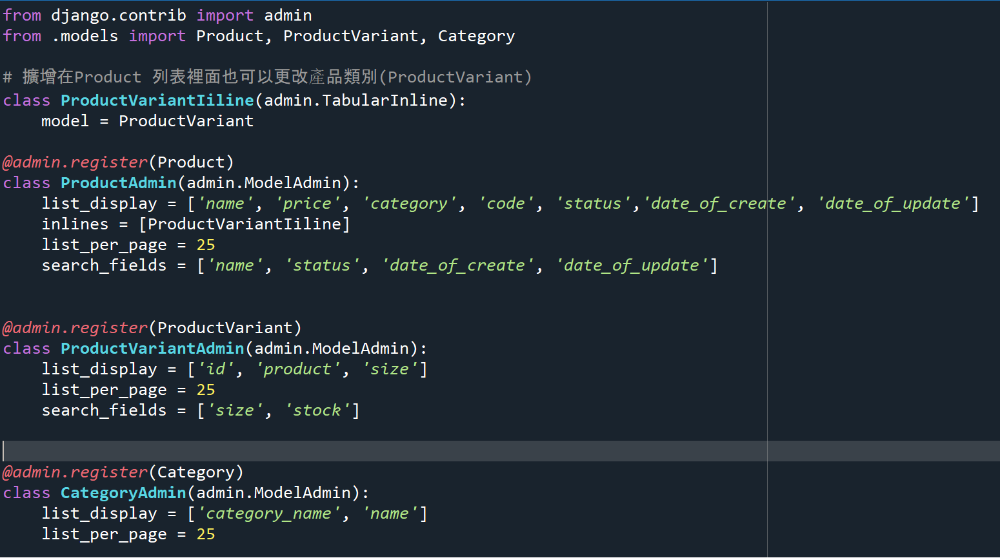 

### product views.py
* ProductsView (所有產品視圖)
使用ListView類別，並且設定model為product，簡化調用資料庫的流程。
    > get_queryset 處理再網頁上面呈現的相關查詢集，讓使用者可以在輸入關鍵字或者選擇查詢選項時可以返回相對應的數值。
    > get_context_data 因為在產品頁面上有多個form的商品查詢表單，為了讓使用者可以執行疊加的查詢，所以在這裡取得表單參數在返回給頁面的form的action，以執行疊加查詢的功能。
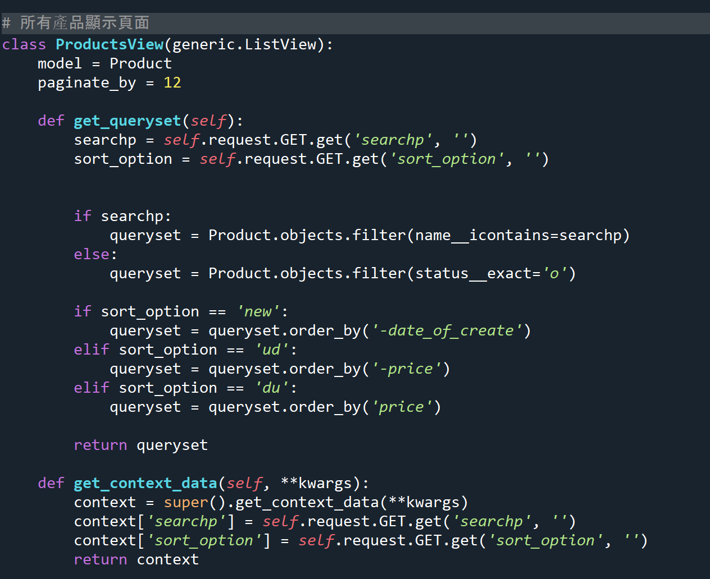

* ProductCategryView (產品種類的視圖)
這裡同ProductView一樣使用ListView類別。大致上都相同，但是因為要根據產品種類去做處理所以對get_queryset函式增加了針對產品種類的資料返回邏輯。
    > 在url方面多設置了以種類名稱顯示的url路徑。
    
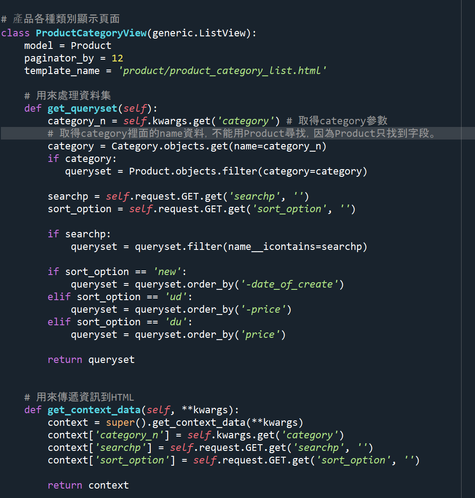

* NewProductView (最新產品視圖)
這裡同ProductView一樣使用ListView類別，多增加了查詢集的切片，讓查詢最多只顯示12項商品。
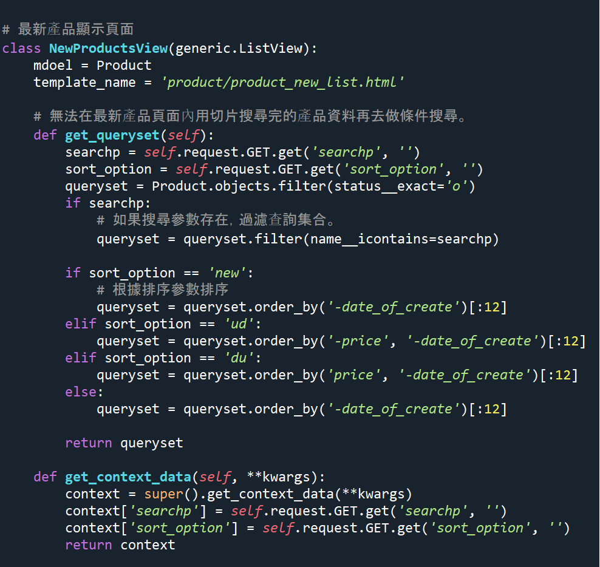

* ProductDetail (產品介紹視圖)
這裡使用DetailView來針對個別產品做顯示，但多了幾個設置。
    > 在Product model要添加一個get_absolute_url方法，讓每一個產品都擁有一個url。
    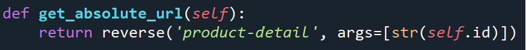
    > 在product的urls裡面針對get_absolute_url方法去配置相對應的網址名稱。
    
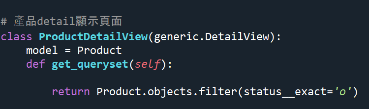

### product urls.py
這裡應用RedirectView函式讓導向product/頁面時跳轉的是所有產品頁面。其餘都是按照相對應的名稱去做設置。
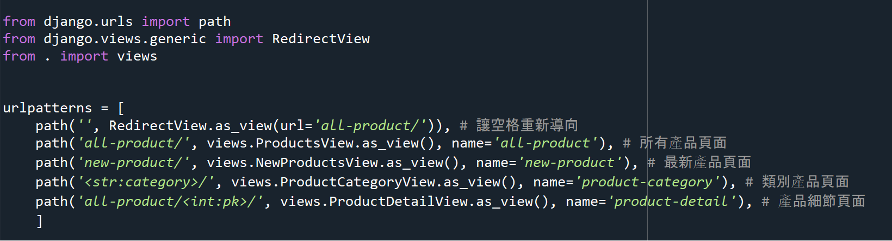

## 網站畫面
1. 主頁

2. 商品頁面

3. 產品頁面

4. 購物車頁面

5. 會員頁面

6. 結帳頁面

7. 店家搜尋頁面

8. 帳號頁面

