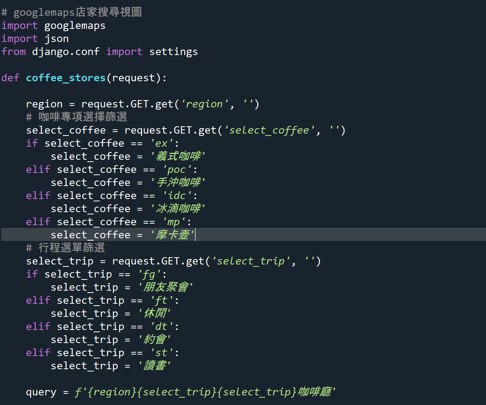
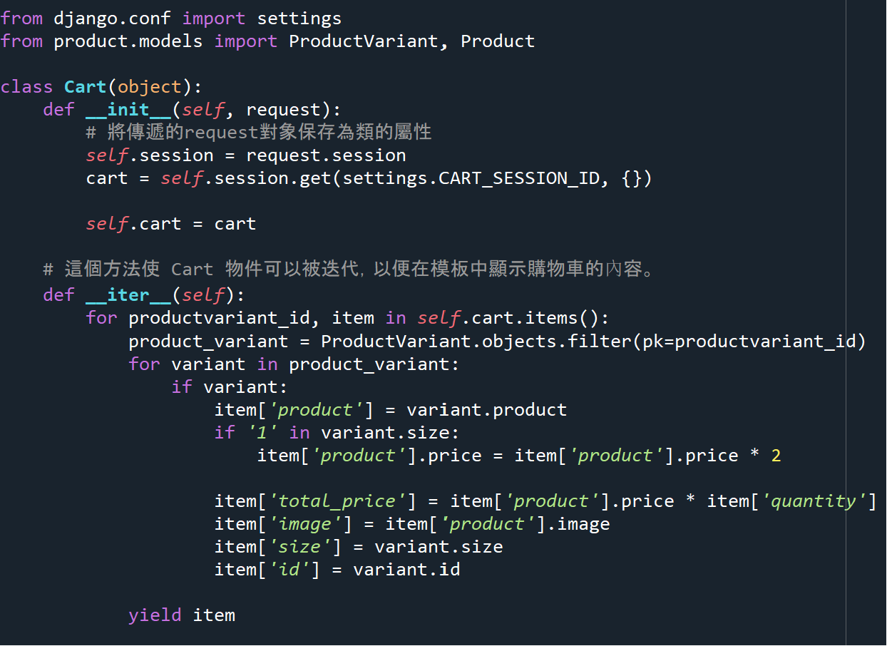

# 專案名稱 KeithCoffee

## 簡介
網站專案主軸是一個咖啡店的店商網站，主要使用Django框架，並利用Bootstrap 5套件來打造現代化的前端。為了增添視覺和內容豐富度，我使用了ChatGPT和Midjourney兩項AI工具，ChatGPT用於生成相關文本內容，Midjourney用於創建引人注目的圖片。此外還有添加一頁Google Map資訊的店家搜尋功能，以提供更多實用性。

# 目錄
- [專案名稱 KeithCoffee](#專案名稱-keithcoffee)
- [前後端介紹](#前後端介紹)
- [APP: Home](#app-home)
  - [Home 主頁](#home-主頁)
  - [Home 使用者的相關功能](#home-使用者的相關功能)
  - [Google Maps Platform (Places API)](#google-maps-platform-places-api)
- [APP: Product](#app-product)
  - [product models.py](#product-modelspy)
  - [product admin.py](#product-adminpy)
  - [product views.py](#product-viewspy)
  - [product urls.py](#product-urlspy)
- [APP: Cart](#app-cart)
  - [cart cart.py](#cart-cartpy)
  - [cart views.py](#cart-viewspy)
  - [cart urls.py](#cart-urlspy)
- [網站畫面](#網站畫面)

## 開發堆疊
### 環境
* **Anaconda Spyder**
    - 用於 Django 框架的後端開發。
* **Sublime Text 3**
    - 用於前端開發，包括 HTML、CSS、AJAX 和 JavaScript。
### 資料庫
    * MySQL
### API
    * Google Maps Platform
        > Places API
### debug tool
    * Django Debug Toolbar

## 安裝與部屬
**以下指令都於終端機完成**

1. 下載Python與虛擬環境。
   - 官網安裝Python https://www.python.org/downloads/ 
   - 安裝虛擬環境 pip install virtualenvwrapper-win
2. 創建虛擬環境
   - 使用 mkvirtualenv 命令來創建一個名為 keithcoffee 的新虛擬環境。
   - mkvirtualenv keithcoffee
3. 使用建構的虛擬環境
   - workon keithcoffee
4. 下載 Django
   - pip install django
5. 下載其他套件
   - pip install mysqlclient (連接 MySQL)
   - pip install Pillow (專案連接圖片路徑專用)
   - pip install django-debug-toolbar (除錯工具)
   - pip install googlemaps (Google API 用)
6. 下載 MySQL
   - 官網連結: [https://dev.mysql.com/downloads/mysql/](https://dev.mysql.com/downloads/mysql/)
   - 下載設定密碼可先設 1234567890 (本 Django 專案設定的密碼)
7. 創建 MySQL 数据庫
   - 進到終端機輸入 mysql -u root -p 輸入後進到 MySQL
   - 進入後輸入 create database keithcoffee (本 Django 專案資料庫名稱) default set utf8 collate urf8_general_ci; 創建資料庫
8. 資料遷移
9. 啟動專案
   - 從終端機進到下載的專案有 manage.py 的根目錄
   - 輸入 pyhton manage.py runserver 如果沒有其他 error 就啟動成功了！
10. 進到網站瀏覽器網址框輸入 http://127.0.0.1:8000/ 進到頁面。

# 前後端介紹

## APP: Home
* Home APP 負責主頁的顯示、使用者的帳號管理、Google Maps Plateform相關API的處理。

### Home 主頁
主頁部分主要著重在url分配給前端做頁面的連接，呈現頁面多以圖片為主。

### Home 使用者的相關功能
* 註冊
    > 註冊表單
    這裡負責使用者註冊的表單，使用UserCreationForm類別做基本的使用者名稱與密碼註冊，再以User model對自定義的email等欄位去做擴展。
    
    > 註冊視圖
    這裡處理表單的內容，讓使用者從註冊頁面輸入完註冊資料儲存到後台後跳轉到主頁。
    

* 登入 & 登出
    > 登入與登出因為沒有特別資料的儲存，所以在urls.py裡面直接使用Django內建的使用者類別LoginView&LogoutView。
    
    > 登入與登出後的頁面跳轉從setting.py做設置。
    

* 更改會員資料
    > 更改會員跟變更密碼是分開的，這裡只處理姓名與email的變更。
    
    > 網站頁面
    
    

* 變更密碼
    > 變更密碼使用Django的變更密碼類別，實現寄送信箱的功能，但因為在都是在本地端實作，所以有預設密碼變更信件是寄送到終端機顯示。
    
    > 所屬變更密碼步驟分別是以下
    1. PasswordResetView 填寫信箱表單，變更密碼連結信件將送往此信箱。這裡有設至email相關的指定使用html的信件內容。
    
    * HEML信件內容
    
    * 網站畫面
    
    2. PasswordResetDoneView 填寫完信箱表單之後的頁面，上面有提示信件已送往。
    * 網站畫面
    
    * 終端機顯示的變更密碼連結畫面
    
    3. PasswordResetConfirmView 收到信件之後，透過上面的連結所連結到的變更密碼的網址頁面。
    
    4. PasswordResetCompleteView 變更成功之後，顯示給使用者看的成功畫面，有加註可以跳轉到登入頁面重新登入。
    

### Google Maps Platform (Places API)
初始想法本來是透過爬蟲來獲取google map上面店家相關資料，但是考慮到要爬取的頁面太多可能導致IP被封鎖，所以選擇使用串接API的方式去呈現相關的內容。
* 網站頁面透過輸入地名與客製的行程、咖啡專項(咖啡沖煮方式)選項，來讓使用者可以更快找到符合期望的咖啡店。另外在咖啡店的篩選方面有過濾掉評論裡面缺乏"好喝"字樣的店家，節省使用者選擇咖啡店需要查看評論的時間。以下會根據程式碼分段介紹。
    

* 針對網頁表單送出的參數去做搜尋資訊(query)的填寫。
    

* 運用在Google Maps Platfoem註冊所獲取的金鑰來做"Places API"的資料獲取，回傳的文檔類似json，第一次使用"places"獲取大約二十筆店家的店家名、平均評分、與店家的地址id。
第二次使用"place"在第一次獲取到的"地址id"去做個別店家資料的獲取。在獲取電話資料時因為遇到有空白的情況，所以有多做一個判斷式。

* 因為從Places API獲取照片資料沒辦法有圖片上的url網址，只有"photo_reference"欄位上的圖片網址參數。所以用到Place Photos功能去get店家照片的二進制圖像數據，並轉換成Base64編碼的二進數組，最後在解碼成UTF-8字符串送到前端HTML做顯示。

* 在這部分Places API只提供每個店家五筆評論，但是因為還是有可能評論少於五筆，所以在讀取相關reviews數據時使用整體資料筆數來當做迴圈的次數。在以上從API獲取的參數加入進store_info之後。再判斷store_info裡面評論是否有"好喝"，如果有的話就加入到最後回傳的store_list裡面。再回傳給前端HTML模板。

## APP: Product
* Product APP 主要負責產品相關的資料庫建置，與產品網站頁面資料的傳輸。
### product models.py
* Product (產品)
    除了基本的名稱、價格、描述、圖片、上架狀態以外，還有商品種類與編號， 
    編號構想是想透過編號上面種類的名稱，更能準確的讓員工或者消費者快速的找到產品。
    在設計編號時，想要透過選取的商品種類可以自動生成帶有商品種類的編號，所以預設填寫設定可以是空值。
           
    之後使用了post_save信號，當一個Product模型的實例保存到資料庫時，這個信號觸發了generate_product_code函數。
    並且會在新增時判斷實例中有無code的存在，如果沒有的話就夠建一個自定義的code資料進實例裡面。

    流程: 
    1. 使用receiver註冊信號post_save與Product model
    2. 保存Product實例時觸發post_save信號。 
    3. 觸發generate_product_code函數，這個函數會接收相關訊息。包括sender(發送信號的模型)、instance(此模型的實立)、created(判斷是否構建)。
    4. 執行函式內部邏輯生成並保存code。
     

* ProductVariant (產品變體)
    因為網站是以咖啡豆為出發點去設計，所以想到咖啡有可能會有一樣品項但是咖啡克數不一樣的情況，所以另外建構一個ProductVariant模型當作Product的外鍵變體。
    但是當初設計此模型時沒有考慮到價格會因為咖啡克數而不一樣的問題，所以在之後呈現變體價格時，透過調用Product模型的價格資料去做相對應的呈現。
     

* Category (產品類型)
    
    設計讓產品分類呈現給使用者。除了更好搜尋之外，也讓網站更多元性。

### product admin.py
後台admin管理頁面增添了一個ProdictVariant模型的選項進ProductAdmin裡面，增加再填寫產品資料時的便利性。
 

### product views.py
* ProductsView (所有產品視圖)
    使用ListView類別，並且設定model為product，簡化調用資料庫的流程。
        > get_queryset 處理再網頁上面呈現的相關查詢集，讓使用者可以在輸入關鍵字或者選擇查詢選項時可以返回相對應的數值。
        > get_context_data 因為在產品頁面上有多個form的商品查詢表單，為了讓使用者可以執行疊加的查詢，所以在這裡取得表單參數在返回給頁面的form的action，以執行疊加查詢的功能。
    

* ProductCategryView (產品種類的視圖)
    這裡同ProductView一樣使用ListView類別。大致上都相同，但是因為要根據產品種類去做處理所以對get_queryset函式增加了針對產品種類的資料返回邏輯。
        > 在url方面多設置了以種類名稱顯示的url路徑。
        
    

* NewProductView (最新產品視圖)
    這裡同ProductView一樣使用ListView類別，多增加了查詢集的切片，讓查詢最多只顯示12項商品。
    

* ProductDetailView (產品介紹視圖)
    這裡使用DetailView來針對個別產品做顯示，但多了幾個設置。
        > 在Product model要添加一個get_absolute_url方法，讓每一個產品都擁有一個url。
        
        > 在product的urls裡面針對get_absolute_url方法去配置相對應的網址名稱。
        
    

### product urls.py
應用RedirectView函式讓導向product/頁面時跳轉的是所有產品頁面。其餘都是按照相對應的類別或產品ID去做設置。

## APP: cart
* 主要負責購物車在頁面上的相關操作與訂單儲存的功能。

### cart cart.py
在cart.py 裡面創建一個Cart的類別，來獲取並操作自定義名稱為"cart"的session的相關操作。設計分別用不同方法來執行使用者對產品與購物車頁面相關的操作。
* 方法 __init__ & __iter__
    初始化獲取cart session後運用收到的productvariant_id去做cart裡面的迭代輸入。使html可以透過for迴圈運用相關資料。
        > 因為只有在Product資料集存在price欄位，所以對產品size咖啡克數為1 POUND(磅)的產品作判斷並加乘，在匯入到原本的price欄位裡面，讓在html相關頁面顯示價格時可以依照不同磅數去做相對應的價格顯示。其餘部分為針對不同的產品變體去做迭代資料的輸入。
    
    以下是HTML運用到的相關參數
    

* 方法 __len__ & save & add
    設定__len__讓在html可以透過{{ cart|length }}去計算顯示購物車裡面的產品總數。
    save方法主要運行session的儲存。
    add方法設計接收三個參數預設分別可以判斷產品的編號、數量與是否更新數量。
    

* 方法 remove & get_total_cost
    remove負責資料的刪除。在add中被運用到當產品為零時就該筆資料。
    get_total_cost負責計算所有產品在購物車的總價格
    

### cart views.py
* add_to_cart
    這裡負責使用者把商品加入購物車。單位都以1為一個單位。
    

* 其他AJAX畫面
    
    > hx_menu_cart
    
    讓使用者在頁面上面可以看到產品加入購物車的數量。
    
    使用cart裡面的__iter__方法，讓購物車裡面總數顯示在主頁。
    
    > hx_cart_total & hx_cart_quantity
    分別顯示購物車裡面總數量與總金額。
    

* update_cart
    這裡負責在購物車裡面讓用戶可以透過+、-來選擇產品的數量的增減。
    處理完回購物車回傳邏輯之後，有多加reponse['HX-Trigger'] = 'update-menu-cart'，來觸發html上面多個hx-trigger="update-menu-cart from:body"的事件。
    讓所有畫面相關的參數都可以同步更新。
    

* checkout
    這裡設計是購物車頁面之後處理訂單表單和連接金流。
    金流串接測試部分是寫在cart APP所以希望在確認訂單後可以儲存訂單資訊，連接到測試的金流頁面。
    > 這裡先介紹位於cart models.py裡面的Order & OrderItem model
    * Order model
        主要負責儲存訂單連結，除了設計一班訂單上的資訊以外，訂單人會綁定已經註冊的人身上。讓管理者可以從admin得知訂購者的資訊。
        
        
    * OrderItem model
        負責訂單資訊外的產品相關連結，讓管理者可以從admin得知產品的銷量狀態。
        
        

    > 訂單有分為主鍵Order與外鍵OrderItem，先透過表單儲存Order model的相關資料，之後再透過已經儲存的Order model去儲存外鍵OrderItem model裡面的資料。
    
    > OrderItem model 透過儲存Order model的資料與購物車裡面的資訊，讓資料更完整。
    

* CheckoutDone & CheckoutFailed
    在結結帳之後跳轉的頁面，在訂單完結帳後會刪除購物車裡面的資訊。
    

* ecpay_view
    綠界金流串接視圖，這裡有一個裝飾器csrf_empty關閉Django的CSRF防護，讓第三方金流可以進入到裡面執行讓消費者付款的動作。
    

### cart urls.py
這裡把有使用到ajax的url跟其他的url做一個區分，在視覺上比較不容易搞混。

## 網站畫面
1. 主頁

2. 商品頁面

3. 產品頁面

4. 購物車頁面

5. 會員頁面

6. 結帳頁面

7. 店家搜尋頁面

8. 帳號頁面

